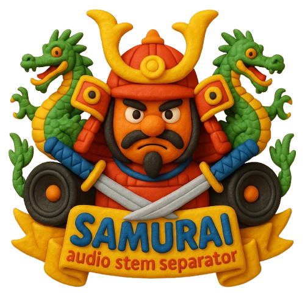

# Samurai

<!-- Project Logo -->
<p align="center">
  
</p>

[](https://github.com/your-org/samurai/actions)
[](LICENSE)
[](CONTRIBUTING.md)

---

## 🎵 Samurai: AI-Powered Audio Stem Separation & Analysis

**Samurai** is a full-stack web app for musicians, producers, and audio engineers to upload tracks, separate stems (vocals, drums, bass, etc.), preview waveforms, and analyze audio using advanced AI models. Download individual stems or all at once, and get instant insights into your music.

---

## ✨ Features
- 🎤 Upload audio (MP3, WAV, etc.)
- ✂️ AI-powered stem separation (vocals, drums, bass, other)
- 🎚️ Waveform preview for original and stems
- 🤖 AI audio analysis (BPM, key, duration, sample rate, tags, transcription)
- 📥 Download separated stems (individually or as ZIP)
- 🏷️ Tagging and metadata extraction
- ⚡ Fast, responsive UI with drag-and-drop support
- 📊 File size badges for uploads and stems
- 🖥️ Modern, mobile-friendly design
- ☁️ Cloud-ready: Deploy to Render (backend) and Vercel (frontend)

---

## 📸 Screenshots

> _Add screenshots here_

| Upload & Analysis | Stems & Player |
|------------------|---------------|
|  |  |

---

## 🚀 Live Demo

- [Frontend on Vercel](https://your-vercel-url.vercel.app) (replace with your actual URL)
- [Backend on Render](https://your-render-url.onrender.com) (replace with your actual URL)

---

## 🛠️ Technology Stack
- **Frontend:** React, TypeScript, Tailwind CSS, Wavesurfer.js, Framer Motion
- **Backend:** Python, Flask, Demucs, Essentia, Gemini AI (for analysis)
- **Other:** Supabase (Stem Vault), Docker, CI/CD

---

## ⚡ Quickstart (from project root)

### 1. Clone the repository
```bash
git clone https://github.com/bantoinese83/samurai.git
cd samurai
```

### 2. Set up environment variables
- **Backend:**
  - Create `server/.env` and add:
    ```
    GEMINI_API_KEY=your_gemini_api_key
    ```
- **Frontend:**
  - Create `client/.env` and add:
    ```
    VITE_API_URL=http://localhost:5001
    VITE_SUPABASE_URL=your_supabase_url
    VITE_SUPABASE_ANON_KEY=your_supabase_anon_key
    ```

### 3. Run the backend (Flask API)
```bash
cd server
python3 -m venv ../venv
source ../venv/bin/activate
pip install -r requirements.txt
python audio_api.py
```
- The backend will run at http://localhost:5001

### 4. Run the frontend (React/Vite)
```bash
cd ../client
npm install
npm run dev
```
- The frontend will run at http://localhost:5173

### 5. Open in your browser
Visit [http://localhost:5173](http://localhost:5173)

---

## 🐳 Docker (optional)

Build and run the backend in Docker:
```bash
docker build -t samurai-backend ./server
docker run -p 5001:5001 --env-file server/.env samurai-backend
```

---

## ☁️ Deployment

### Backend (Render)
1. Push your code to GitHub.
2. Create a new **Web Service** on [Render](https://render.com/):
   - Root Directory: `server`
   - Build Command: `pip install -r requirements.txt`
   - Start Command: `gunicorn audio_api:app`
   - Add environment variable: `GEMINI_API_KEY`
3. Set up persistent storage if needed for uploads/results.

### Frontend (Vercel)
1. Import your repo on [Vercel](https://vercel.com/).
2. Set project root to `client`.
3. Set build command: `npm run build`
4. Set output directory: `dist`
5. Add environment variables:
   - `VITE_API_URL=https://your-backend-url.onrender.com`
   - `VITE_SUPABASE_URL`, `VITE_SUPABASE_ANON_KEY`
6. Deploy!

---

## 🧪 API Usage

### Separate Audio (POST /separate)
```bash
curl -X POST -F "file=@path_to_your_audio.mp3" https://your-backend-url.onrender.com/separate
```
- Returns: JSON with job ID, progress, audio features, AI analysis, and download links.

### Progress (GET /progress/{job_id})
- Returns: JSON with current progress and status.

### Example Response
```json
{
  "job_id": "unique_job_id",
  "status": "completed",
  "progress": 100,
  "message": "Audio separation completed!",
  "audio_features": { "bpm": 120.5, "key": "C major", ... },
  "gemini_analysis": { "tags": ["hip-hop", ...], "description": "..." },
  "download_url": "https://.../results/yourfile.zip"
}
```

---

## ⚙️ Environment Variables

- **Backend:**
  - `GEMINI_API_KEY` (for AI analysis)
- **Frontend:**
  - `VITE_API_URL` (backend URL)
  - `VITE_SUPABASE_URL`, `VITE_SUPABASE_ANON_KEY` (for Stem Vault)

---

## 🧩 Folder Structure
```
samurai/
  client/      # React frontend
  server/      # Python Flask backend
  uploads/     # Uploaded audio files
  results/     # Separated stems output
  venv/        # Python virtual environment
  README.md    # This file
```

---

## 🛠️ Troubleshooting & FAQ
- **Worker timeout or OOM on Render?**
  - Free tier has memory/CPU limits. Try smaller files or upgrade your plan.
  - Increase Gunicorn timeout with `--timeout 300` if needed.
- **Gemini AI errors?**
  - Make sure your API key is valid and has quota.
  - AI features are optional; the app works without them.
- **Supabase errors?**
  - Check your Supabase URL and anon key in `.env` and Vercel settings.
- **Frontend can't reach backend?**
  - Make sure `VITE_API_URL` is set to your backend's deployed URL.
- **CORS issues?**
  - The backend enables CORS for development; configure as needed for production.

---

## 🤝 Contributing
- Fork the repo and create your branch from `main`.
- Follow code style and best practices (TypeScript, PEP8, etc.).
- Open issues for bugs/feature requests.
- Submit pull requests with clear descriptions.
- See [CONTRIBUTING.md](CONTRIBUTING.md) for more.

---

## 📝 License
This project is licensed under the [MIT License](LICENSE).

---

## 🙏 Credits & Acknowledgments
- [demucs](https://github.com/facebookresearch/demucs) for stem separation
- [Essentia](https://essentia.upf.edu/) for audio analysis
- [Wavesurfer.js](https://wavesurfer-js.org/) for waveform rendering
- [Google Gemini AI](https://ai.google.dev/) for advanced analysis
- [Supabase](https://supabase.com/) for cloud storage
- All open source contributors and libraries

---

## 📬 Contact
- Project Lead: [Bryan Antoine](mailto:b.antoine.se@gmail.com)
- GitHub: [github.com/bantoinese83/samurai](https://github.com/bantoinese83/samurai)

> _Built with passion for music and technology._ 